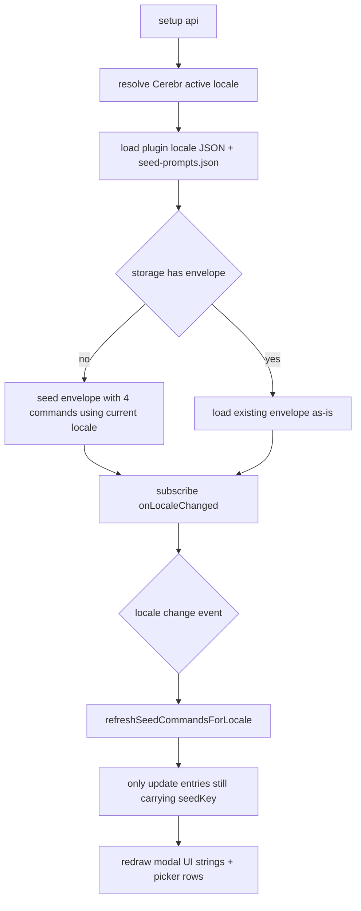

# Lite Slash Commands Plugin Optimization — Design Spec

- **Target plugin**: `statics/dev-plugins/lite-slash-commands/`
- **Plugin version bump**: `0.3.0` → `0.4.0`
- **Spec date**: 2026-04-17
- **Status**: approved for implementation planning

## 1. Overview

This spec optimizes the Cerebr dev-plugin **Lite Slash Commands** along three axes:

1. **Seed slimming** — reduce the 17 default commands down to a focused 4-command core set so new users see a clean slate, while the original 17 remain available as a "example library" file that can be restored via Import JSON.
2. **Plugin-local i18n + `{{lang}}` placeholder** — remove all hardcoded `台灣正體中文` from prompts, use a `{{lang}}` placeholder that resolves at expansion time based on the user's Cerebr UI locale. All plugin UI strings (modal, buttons, picker, status line) are localized inside the plugin itself (not merged into Cerebr's main `_locales/`). Seed command `name` / `label` / `description` follow the UI locale; once the user edits a command, their version is preserved forever.
3. **Two-view Modal redesign + CSS fix** — replace the cramped two-column grid modal with a single-column two-view state machine (list ↔ edit), move import/export/reset into an overflow menu, and fix the settings `/` button getting visually clipped at the input bar edge.

Non-goals:

- Not adding a unit test framework (Jest/Vitest) to the repository — manual verification checklist stays the primary gate, with optional standalone Node self-test scripts for pure helpers.
- Not modifying Cerebr's main `_locales/*/messages.json`.
- Not migrating existing user data automatically; existing envelopes are preserved until the user explicitly clicks **Reset defaults**.

## 2. Architecture

### 2.1 File layout

```text
statics/dev-plugins/lite-slash-commands/
  plugin.json                     # version bumped to 0.4.0
  shell.js                        # refactored modal & i18n integration
  default-commands.legacy.json    # legacy input (kept, only used as prompt source)
  example-library.json            # NEW — the original 17 command library, user-importable
  seed-prompts.json               # NEW — 4 seed prompts (language-agnostic with {{lang}})
  locales/                        # NEW — plugin-local i18n map
    zh_TW.json
    zh_CN.json
    en.json
  helpers/                        # NEW — pure modules, dependency-free
    language-placeholders.js
    plugin-i18n.js
    __selftest__.mjs              # optional Node standalone self-test
```

### 2.2 High-level runtime flow



Key decisions:

- All `{{lang}}` expansion happens **only at draft-expansion time** (`buildExpandedDraft`). Storage always keeps the raw `{{lang}}` tokens.
- UI locale lookup uses `import { getActiveLocale, onLocaleChanged } from '/src/utils/i18n.js'` per the official template convention for absolute same-origin imports.
- The plugin ships its own locale map (not added to Cerebr `_locales/`), keeping the plugin self-contained as the user requested.

## 3. Section 1 — Seed Slimming + Backward Compatibility

### 3.1 Default seed contents

Order (fixed): `解釋` → `翻譯` → `摘要` → `程式碼解釋` (zh_TW naming). Each seed entry is generated per-locale from the plugin locale JSON's `seed_commands` block, plus the shared `seed-prompts.json` file.

The prompts come from the existing legacy JSON but with every instance of `台灣正體中文` replaced by `{{lang}}`:

```text
explain       → "... produce a clear and accessible explanation in {{lang}}. ..."
translate     → "Translate the content provided ... into {{lang}}. ..."
summarize     → "... produce a concise summary in {{lang}} within 3–5 sentences. ..."
code_explain  → "You are a senior software engineer ... respond in {{lang}}, structured as follows: ..."
```

### 3.2 seedVersion bump

- New seed version: `2026-04-17-minimal-seed-1`
- Legacy seed version: `2026-04-08-backup-seed-1`

### 3.3 Backward compatibility policy

The storage-read path follows this rule matrix:

| Existing storage state | Behavior on load |
|---|---|
| No envelope | Seed envelope with 4 commands using current locale |
| Envelope with older seedVersion | Load as-is, **do not replace user data** |
| Envelope with matching seedVersion | Load as-is |

Users who already have the 17-command envelope will **keep it**. They can manually click **Reset defaults** to switch to the new 4-command seed (and the button now seeds only 4, not 17).

### 3.4 Example library preservation

The original 17-command seed content moves to `example-library.json` inside the plugin folder. It can be loaded via the **Import JSON** menu if a user wants any of the advanced prompts. The file is a plain JSON array matching the existing legacy shape for easy paste-in.

## 4. Section 2 — Plugin-Local i18n + `{{lang}}` Placeholder

### 4.1 `locales/<code>.json` shape

```jsonc
{
  "ui": {
    "settings_title": "Lite Slash Commands",
    "settings_subtitle": "備份預設值會首次播種到外掛私有儲存...",
    "button_aria_label": "管理斜線命令",
    "list_empty": "還沒有斜線命令，點「新增命令」開始建立。",
    "create_command": "新增命令",
    "more_menu": "更多",
    "reset_defaults": "重設預設值",
    "export_json": "匯出 JSON",
    "import_json": "匯入 JSON",
    "import_note": "匯出格式是外掛私有 envelope；匯入時也接受單純的命令陣列。",
    "back_to_list": "← 回清單",
    "close": "關閉",
    "save_changes": "儲存變更",
    "delete_command": "刪除命令",
    "move_up": "上移",
    "move_down": "下移",
    "dirty_indicator_tooltip": "有未儲存變更",
    "field_name_label": "命令名稱",
    "field_label_label": "顯示標題",
    "field_aliases_label": "別名",
    "field_aliases_placeholder": "用逗號或換行分隔",
    "field_aliases_note": "別名只用於搜尋與輸入匹配，不會另外顯示成主要命令名。",
    "field_description_label": "描述",
    "field_description_placeholder": "簡短說明這個命令會做什麼",
    "field_prompt_label": "提示詞內容",
    "field_prompt_placeholder": "真正展開到草稿區的提示詞",
    "status_saved": "已儲存 /$1。",
    "status_created": "已新增 /$1，記得按儲存才會寫入。",
    "status_deleted": "已刪除 /$1。",
    "status_reordered": "已更新 /$1 的排序。",
    "status_reset_done": "已重設為預設值。",
    "status_imported": "已匯入 $1 筆斜線命令。",
    "status_count": "目前共有 $1 筆斜線命令。",
    "error_name_required": "命令名稱不能留白。",
    "error_prompt_required": "提示詞內容不能留白。",
    "error_json_parse": "JSON 解析失敗：$1",
    "picker_empty": "目前沒有符合的斜線命令，點右側 / 按鈕管理命令。",
    "blank_command_name": "新命令 $1",
    "blank_command_prompt": "請在這裡輸入提示詞。"
  },
  "seed_commands": {
    "explain":      { "name": "解釋",       "label": "解釋",       "description": "" },
    "translate":    { "name": "翻譯",       "label": "翻譯",       "description": "" },
    "summarize":    { "name": "摘要",       "label": "摘要",       "description": "" },
    "code_explain": { "name": "程式碼解釋", "label": "程式碼解釋", "description": "" }
  },
  "language_label": "台灣正體中文"
}
```

- `ui.*` is consumed by the plugin's `t('ui.xxx', [subs])` helper.
- `seed_commands.*` provides locale-specific `name`/`label`/`description` for the 4 seed entries.
- `language_label` is the natural-language label used when expanding `{{lang}}` placeholders for this locale.

`zh_CN.json` mirrors with `简体中文` translations; `en.json` uses `English`.

### 4.2 `{{lang}}` placeholder expansion

`helpers/language-placeholders.js`:

```js
// Public pure function. Returns the input text with {{lang}} tokens
// replaced by the natural-language label for the given locale.
//
// Token matching rules (permissive):
// - Case-insensitive for `lang`
// - Optional whitespace around the token: {{ lang }}, {{LANG}}, {{Lang }}
// - Unknown locales fall back to English
export function expandLanguagePlaceholders(text, localeLabel) { ... }
```

Called only inside `buildExpandedDraft`:

```js
function buildExpandedDraft(command, trailingText, localeLabel) {
  const prompt = expandLanguagePlaceholders(String(command?.prompt ?? '').trimEnd(), localeLabel);
  const tail = String(trailingText ?? '').trimStart();
  return tail ? `${prompt}\n\n${tail}` : prompt;
}
```

### 4.3 `plugin-i18n.js`

Responsibilities (all synchronous after the initial async load):

- `async loadPluginLocale(localeCode)` — fetches `./locales/${localeCode}.json` relative to `import.meta.url`, with cache-busting via `cerebr_plugin_rev` query if available. Caches the loaded map in module state. Falls back to `en.json` if the requested locale fails to load, and to an empty map if both fail. Returns the loaded map for convenience.
- `t(key, substitutions?)` — resolves keys like `'ui.save_changes'` / `'ui.status_imported'` with `$1`-style substitutions (matching Cerebr's existing convention). If a key is missing, returns the key verbatim so we can spot gaps in UI.
- `getLocaleLabel()` — returns the active locale's `language_label` (for `{{lang}}` expansion).
- `getSeedCommandMeta(seedKey)` — returns `{ name, label, description }` for a given seed key from the active locale, or `null` if the seed key is unknown.
- `onLocaleChanged(handler)` — subscribes to Cerebr's `cerebr:localeChanged` window event (relaying via imported `onLocaleChanged` from `/src/utils/i18n.js`). Returns an unsubscribe function.

### 4.4 Seed command metadata sync on locale change

On `cerebr:localeChanged`:

1. Reload plugin locale JSON for the new code.
2. For every command in `envelope.commands` where `seedKey` is truthy, overwrite `name`, `label`, `description` with the new locale's `seed_commands[seedKey]` values.
3. Persist the envelope silently.
4. Rebuild picker + modal UI strings.

User-edited commands (where `seedKey` was cleared on save) are never touched.

### 4.5 Data model changes

`CommandEntry` schema (v2):

```jsonc
{
  "id": "uuid-or-fallback",
  "name": "解釋",
  "label": "解釋",
  "prompt": "...",
  "description": "",
  "aliases": [],
  "seedKey": "explain",   // NEW — optional, only present on unmodified seed entries
  "createdAt": 1775268788385,
  "updatedAt": 1775268788385
}
```

- `normalizeStoredCommandEntry` preserves `seedKey` when present.
- `saveCurrentCommand` clears `seedKey` from the saved entry (sticky opt-out from future locale sync).
- `serializeEnvelope` writes `seedKey` only when defined (keeps JSON tidy).
- Importing envelopes that omit `seedKey` is a no-op (treated as user-authored commands).

## 5. Section 3 — Two-View Modal + CSS Fix

### 5.1 Modal state machine

Replace the existing two-column `grid-template-columns: sidebar | editor` layout with a single column driven by `data-view`:

- `data-view="list"` — command list + toolbar
- `data-view="edit"` — editor fields + per-command actions

Transitions:

```text
open modal         → view=list
click command card → view=edit, selectedCommandId=card.id, isNewDraft=false
click "新增命令"   → view=edit, selectedCommandId=<draft uuid>, isNewDraft=true
click "← 回清單"   → view=list, discard draft if isNewDraft
Esc in edit view   → same as "← 回清單"
Esc in list view   → close modal
save in edit view  → persist, stay on edit view, clear dirty flag
delete in edit view → persist deletion, view=list
```

Draft-state rule: clicking "新增命令" does **not** persist a new entry. The draft lives in `runtimeState.editorDraft` (shape: `{ isNewDraft: boolean, command: CommandEntry, hasUnsavedChanges: boolean }`) and is only written to `envelope.commands` when the user clicks **儲存變更**. Pressing `← 回清單` silently discards unsaved drafts so the list never grows junk placeholder entries.

When entering edit view for an existing command, `editorDraft` is initialized as `{ isNewDraft: false, command: <copy of selected>, hasUnsavedChanges: false }`. Input listeners diff against the stored command to toggle `hasUnsavedChanges`. Save writes back into `envelope.commands`; cancel drops the draft.

### 5.2 Dirty indicator

Track `hasUnsavedChanges` in `runtimeState.editor` via input listeners on the 5 editable fields (name, label, aliases, description, prompt). Render a small red dot (`●`) beside the command token in the edit view header when dirty. No blocking confirm dialog — silent discard matches the user's approved policy.

### 5.3 Toolbar restructure

List view toolbar:

- `[➕ 新增命令]` — primary action
- `[⋯ 更多]` — opens a popover with: **重設預設值 / 匯出 JSON / 匯入 JSON**

Export JSON and Import JSON each open a sub-panel inside the popover (or, simpler, replace the popover content with a textarea + action button). Clicking elsewhere dismisses.

Edit view toolbar:

- Top: `[← 回清單]` (left-aligned), `[✕]` close (right-aligned)
- Bottom: `[↑ 上移] [↓ 下移] [🗑 刪除命令] [💾 儲存變更]` — save is primary, delete is destructive-styled

### 5.4 CSS changes

```css
/* Fix: settings / button was clipped against the input bar edge */
.cerebr-lite-slash-settings-button {
  margin-left: 8px;
  margin-right: 8px;  /* NEW — symmetric breathing room */
}

/* Modal narrower for sidebar contexts */
.cerebr-lite-slash-modal__panel {
  width: min(480px, calc(100vw - 24px));  /* was 940px */
  max-height: min(88vh, 720px);           /* was 78vh / 860px */
  grid-template-rows: auto 1fr;           /* unchanged */
}

/* New: single-column body driven by data-view */
.cerebr-lite-slash-modal__body {
  display: block;        /* was grid w/ 2 columns */
  min-height: 0;
}

.cerebr-lite-slash-modal__body[data-view="list"] .cerebr-lite-slash-modal__editor,
.cerebr-lite-slash-modal__body[data-view="edit"] .cerebr-lite-slash-modal__sidebar {
  display: none;
}

/* Dirty red-dot indicator */
.cerebr-lite-slash-modal__dirty-dot {
  display: inline-block;
  width: 8px;
  height: 8px;
  border-radius: 999px;
  background: #fb7185;
  margin-left: 8px;
  vertical-align: middle;
}

/* Responsive fullscreen at ≤480px */
@media (max-width: 480px) {
  .cerebr-lite-slash-modal__panel {
    width: 100vw;
    max-height: 100vh;
    border-radius: 0;
  }
}
```

### 5.5 Accessibility

- Command list uses `role="list"` with cards as `role="listitem"` (was `role="listbox"` / `role="option"`, but single-select navigation was never actually wired, so plain list is more honest).
- Edit view wrapper gets `role="form"` and `aria-labelledby` pointing to the command token heading.
- Back button: `aria-label="回命令清單"` even though it shows `←` text, so screen readers don't announce "left arrow".
- Focus management:
  - Entering edit view → focus `#cerebr-lite-slash-name` input.
  - Returning to list view → focus the card whose `dataset.commandId` matches the previously selected id; if draft was discarded, focus the `➕ 新增命令` button.
- `Esc` key handled at `runtimeState.chrome.modal` level, not on individual elements, to avoid interfering with native input behaviors.

## 6. Section 4 — Verification Strategy

### 6.1 Manual verification (primary)

Extend `docs/lite-slash-command-plugin-test-guide.md` with five new sections (A–E) covering:

- Seed slimming (new user vs. existing user vs. reset defaults)
- `{{lang}}` placeholder expansion (zh_TW / zh_CN / en)
- i18n UI (locale switch redraws modal/picker/seed names)
- Two-view UX (view switch, dirty indicator, draft discard, focus flow)
- CSS visuals (no clipping, narrow-sidebar fit, dark/light, ≤480px RWD)

### 6.2 Optional pure-helper self-test

Non-blocking script at `statics/dev-plugins/lite-slash-commands/helpers/__selftest__.mjs`:

```bash
node --experimental-vm-modules \
  ./statics/dev-plugins/lite-slash-commands/helpers/__selftest__.mjs
```

Uses Node's built-in `assert` — zero dependencies. Covers:

- `expandLanguagePlaceholders` — multiple tokens, whitespace variants, unknown locale fallback, no-op passthrough
- Locale JSON schema — every `locales/*.json` has `ui`, `seed_commands` with the 4 required keys, and `language_label`
- Seed-prompts JSON schema — has the 4 expected keys, each is a non-empty string

### 6.3 Regression checks

Re-run the existing 10 manual test cases in the guide (slash trigger, fuzzy search, keyboard nav, Enter commit, trailing text, Escape dismiss, pointer select, normal send, and two optional regression cases).

### 6.4 Commit split / PR structure

Branch: `feat/lite-slash-commands-v0.4.0`

Commit-level breakdown (each is an independently reviewable unit):

1. `feat(lite-slash): slim default seed to four core commands` — `default-commands.legacy.json`, `seed-prompts.json`, `example-library.json`, `seedVersion` bump
2. `feat(lite-slash): add {{lang}} placeholder + plugin-local i18n` — `locales/`, `helpers/language-placeholders.js`, `helpers/plugin-i18n.js`, wire into `shell.js`
3. `refactor(lite-slash): split modal into list/edit views` — DOM/CSS rewrite, draft state, dirty indicator, overflow menu
4. `fix(lite-slash): keep settings button breathing from input bar edge` — CSS margin-right
5. `docs(lite-slash): extend manual verification guide` — append sections A–E
6. `chore(lite-slash): bump plugin version to 0.4.0` — `plugin.json`

## 7. Risks & Open Questions

- **Absolute import availability** — the plugin relies on `/src/utils/i18n.js` being resolvable from the plugin sandbox. Template docs confirm this works for local sideloaded plugins; integration test needs to confirm for the published build path too.
- **Locale event timing** — `onLocaleChanged` may fire before the plugin's `setup` completes. The subscription must therefore be registered before any asynchronous work and guarded by `runtimeState.started` where relevant to avoid double-renders.
- **Example library discoverability** — the 17-command example set ships in `example-library.json` but there is no UI button to one-click import it (only the paste-into-textarea flow). Acceptable for v0.4.0 per user direction; a future "Load example library" button can be added if demand arises.
- **Existing users' seedVersion check** — we do not prompt existing users to upgrade. This is intentional: no one should be surprised by disappearing commands. Users who want the new seed explicitly click **Reset defaults**.
